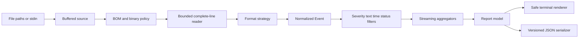
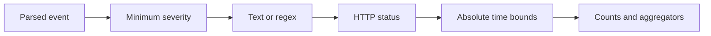

# Architecture

`logwatch` is a streaming pipeline. It turns each complete input record into a small internal event,
applies filters, updates bounded aggregators, and renders only the final report. The terminal and
JSON paths share the same analysis result, so presentation cannot change scan semantics.

## Pipeline



The implementation keeps source processing and analysis separate:

- `scanner` owns source lifetime, decoding policy, line-size bounds, and follow polling.
- `parser` owns format recognition and optional field extraction.
- `aggregate` owns filters and state that must survive across records.
- `model` owns the internal event types and serializable report shapes.
- `render` owns human-readable layout and terminal sanitization.

## Input and decoding

Each path is opened directly with Rust filesystem APIs. `-` selects a locked stdin handle. Paths are
processed in argument order and exact duplicate path strings are ignored. Directories are not
accepted as an implicit recursive scan, which prevents accidental analysis of unrelated files.

The reader uses a 64 KiB `BufReader`. It detects UTF-8, UTF-8 with BOM, UTF-16 little-endian with
BOM, and UTF-16 big-endian with BOM. Without an explicit binary override, a NUL byte in the first
buffer marks the source as binary-looking and the source is skipped with a report warning.

The line reader stores at most `--max-line-bytes` bytes or UTF-16 code units for one record. It still
consumes the rest of an overlong physical line so the next record is aligned correctly. The record
is counted as truncated and is not passed to a parser. Invalid UTF-8 is converted with replacement
characters and counted once per line.

This gives the primary memory invariant:

```text
memory for input records <= configured maximum line size + reader buffer
```

The JSON parser can allocate additional space for the current decoded object, but that object is
also bounded by the current line size.

## Event model

Parsers produce a shared event with optional fields:

```text
Event {
    timestamp: optional zoned, wall-clock, or partial timestamp
    severity: trace, debug, info, notice, warn, error, critical, fatal, or unknown
    message: retained message text for filtering and fingerprinting
    parser: plain, jsonl, nginx, or syslog
    http: optional method, path, status, size, and duration fields
}
```

An event does not retain the complete original line after it has been consumed. The raw line is
therefore never accumulated in a report-sized collection. Message filters run against the current
event before it is dropped.

## Parser strategies

Automatic parsing evaluates each record independently. The order is:

1. An object-looking record beginning with `{` is sent to the JSON Lines parser.
2. A line matching the common access-log shape is sent to the Nginx parser.
3. A line matching the syslog-like shape is sent to the syslog parser.
4. Every other record uses the tolerant plain-text parser.

Explicit `--format` selection bypasses the auto selection. Failed structured parsing produces a
fallback text event and an aggregated warning. This preserves information and makes parser failure
visible without aborting a large scan.

The plain parser searches only a short prefix for ISO-like timestamps. It accepts timezone-aware
values and timezone-less wall-clock values separately. It recognizes severity in prefix, bracketed,
and key-value contexts. A generic word in the middle of a sentence is not enough to mark severity.

Access parsing understands the common quoted request form and extracts the request method, path
without a query string, status, response size, and an optional trailing request time. Structured
JSON parsing uses a small allowlist of common field names instead of retaining arbitrary nested
objects.

## Filtering order

Filtering occurs before all matched-record aggregation:



This means `recordsParsed` describes parseable records before filters and `recordsMatched` describes
records that contribute to severity, patterns, HTTP, and time analysis. A time filter accepts only
timezone-aware timestamps. Wall-clock and partial timestamps are counted as unavailable for that
filter rather than being assigned an invented timezone.

The `regex` crate is used for user patterns. It does not implement backreferences or look-around,
which keeps matching cost bounded by input length for supported expressions.

## Bounded aggregation

Several useful summaries can grow with input diversity, so each is bounded deliberately.

### Message and endpoint heavy hitters

Message patterns and endpoints use a Space-Saving table. The table stores at most
`--max-patterns` keys, a count, an error estimate, and a stable internal identifier. A new key that
arrives after the table is full replaces the current minimum. The replacement count is initialized
from the evicted minimum, which preserves a useful heavy-hitter approximation without retaining all
unique values.

The report sets `approximate` and increments `evictions` when replacement occurs. The human renderer
shows the same fact, and JSON includes `errorEstimate` for each entry. This prevents a high-cardinality
or adversarial log from turning the tool into an unbounded hash map.

### HTTP counters

Status counts use a small ordered map because the status-code space is bounded. Method counts use a
bounded ordered map, and endpoint keys use the same heavy-hitter table. Query strings are removed
before endpoint aggregation to reduce cardinality and avoid displaying common query-string secrets.

### Temporal series

Zoned and wall-clock timestamps use separate adaptive axes. Each axis starts with one-minute buckets.
When the number of buckets exceeds `--max-time-buckets`, the interval doubles and all existing
buckets are re-bucketed. The operation is bounded by the configured number of buckets and is rare
for ordinary files. An axis marks itself approximate when rebucketing occurred.

Records with syslog-style month-day timestamps have no absolute axis because a year is not known.
They remain visible in timestamp counters but do not enter the series.

### Warnings

Warnings are aggregated by stable category codes. Global warnings retain up to 64 categories and
per-input warnings retain up to 32. Additional warning instances increment a capacity counter rather
than creating unbounded messages.

## Rendering and JSON

The report model contains only counters, bounded collections, and optional scalar metadata. The
human renderer formats that model into sections for input, time, severity, parser coverage, message
patterns, HTTP data, and warnings. Dynamic text passes through `sanitize_terminal`, which renders
control characters as visible escape notation. No log-provided ANSI sequence reaches the terminal.

JSON is serialized directly from the report model with `serde_json`. It uses camelCase fields and a
top-level `schemaVersion`. It has no color, cursor movement, progress text, or human layout strings.
The same document remains valid when a source cannot be opened because the source error is recorded
in the corresponding input object and the process returns exit code `1`.

## Follow mode

Follow mode keeps one `RecordReader<BufReader<File>>` alive so buffered state and incomplete final
lines survive polling cycles. It processes only complete lines during the follow loop. The reader's
physical byte position is compared with path metadata; a length decrease resets the reader and
starts a new analysis state. The implementation does not claim portable same-size inode or file-ID
detection because the Rust standard library does not expose a uniform cross-platform primitive for
that case.

Polling sleeps for the requested interval after each report. There is no busy loop and no raw terminal
mode. The report is refreshed with terminal clear and cursor-home sequences emitted by the program,
while all log-derived content remains sanitized.

## Tradeoffs and extension points

The first release chooses predictable local behavior over a plugin framework:

- Format support is represented by a small parser strategy enum, so another parser can be added
  without changing the aggregation engine.
- Arbitrary structured fields are not copied into every event. New first-class fields can be added
  to `Event` with focused parser and report tests.
- Directory traversal, compressed archives, remote URLs, and persisted configuration are outside the
  initial product boundary.
- Heavy-hitter approximation is explicit. An exact top-k result for arbitrarily diverse input would
  require unbounded state or an external storage strategy, neither of which belongs in the default
  local scan path.
- Follow mode uses portable polling rather than a platform-specific filesystem notification layer.

New parser work should add parser-unit coverage, CLI integration coverage, and a documentation note
that explains what format is recognized and what remains generic.
